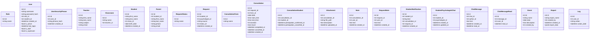

# Диаграмма классов (без связей)

Ниже представлена диаграмма классов проекта в формате Mermaid.  
Связи между классами намеренно **не указаны** (по текущему запросу).

```mermaid
classDiagram
direction TB

class Role {
  +int id
  +string name
}

class User {
  +int id
  +string username
  +string password_hash
  +int role_id
  +int student_id
  +datetime created_at
  +bool is_active
  +datetime last_login
  +bool is_staff
  +bool is_superuser
}

class UserSecurityPhrase {
  +int id
  +int user_id
  +string phrase_hash
  +datetime created_at
}

class Teacher {
  +int id
  +string first_name
  +string last_name
  +string subject
  +string email
}

class Classroom {
  +int id
  +string name
  +int teacher_id
}

class Student {
  +int id
  +string first_name
  +string last_name
  +int class_id
  +date birth_date
  +datetime created_at
}

class Parent {
  +int id
  +int student_id
  +string first_name
  +string last_name
  +string phone
  +string email
}

class RequestStatus {
  +int id
  +string name
}

class Request {
  +int id
  +int student_id
  +int psychologist_id
  +string source
  +int status_id
  +datetime created_at
}

class ConsultationForm {
  +int id
  +string name
}

class Consultation {
  +int id
  +int request_id
  +int form_id
  +date date
  +time start_time
  +time end_time
  +int duration
  +text result
  +datetime completed_at
  +datetime cancelled_at
  +datetime created_at
}

class ConsultationStudent {
  +int id
  +int consultation_id
  +int student_id
  +datetime participation_confirmed_at
  +datetime participation_cancelled_at
}

class Attachment {
  +int id
  +int consultation_id
  +string file_path
  +text description
  +datetime uploaded_at
}

class Note {
  +int id
  +int consultation_id
  +int user_id
  +text text
  +datetime created_at
}

class RequestNote {
  +int id
  +int request_id
  +int user_id
  +text text
  +datetime created_at
}

class StudentNotification {
  +int id
  +int student_id
  +string kind
  +int consultation_id
  +int request_id
  +datetime created_at
}

class StudentPsychologistChat {
  +int id
  +int student_id
  +int psychologist_id
  +datetime created_at
  +datetime updated_at
}

class ChatMessage {
  +int id
  +int chat_id
  +int author_id
  +text text
  +datetime created_at
  +datetime read_at
}

class ChatMessageRead {
  +int id
  +int message_id
  +int user_id
  +datetime read_at
}

class Event {
  +int id
  +string name
  +date date
  +text description
  +int created_by
}

class Report {
  +int id
  +string report_name
  +int created_by
  +datetime created_at
  +jsonb report_data
}

class Log {
  +int id
  +int user_id
  +string action
  +datetime action_date
}
```

